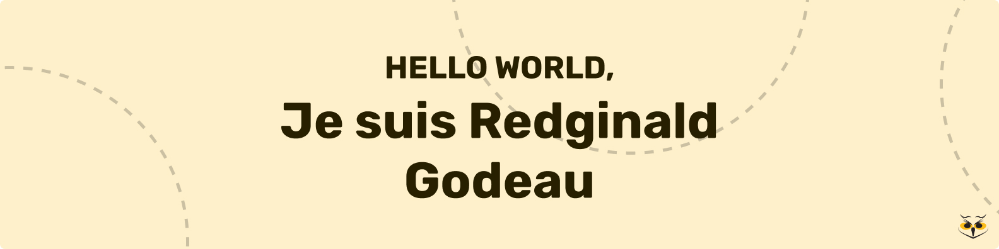

# Hello World 👋, Je suis Redginald Godeau

Je suis passionné par le développement informatique depuis mon enfance et je code depuis toujours. Fort de presque deux ans d'expérience en entreprise grâce à un stage et une alternance, j'ai acquis des compétences solides en développement fullstack. Je m'intéresse également au design et au DevOps, des domaines qui me passionnent.

**Je cherche une alternance en développement Fullstack pour Juin / Juillet**

## Stack

## Showcase

**Matoo** - Une application (encore en developpement) pour regrouppé les informations de ses animaux (Vaccins, poids, ...) [Lien](https://matoo.redginaldgodeau.dev/)

**WormsWasher** - un jeu adapté de snake en golang: [Lien](https://github.com/RedginaldGodeau/WormsWasher)

**Livebot** - un bot discord pour envoyer des mêmes en ligne en temps réel: [Lien](https://github.com/RedginaldGodeau/Live-Bot)

**Pokedex Go** - un pokedex en golang avec une stack GOAT: [Lien](https://github.com/RedginaldGodeau/pokedex-golang-goat)

**Game of life** - un jeu de la vie en golang & opengl: [Lien](https://github.com/RedginaldGodeau/Golang-OpenGL-GameOfLife)

## Liens

<a href="https://www.linkedin.com/in/redginald-godeau-04ab8a254/" target="blank"></a>
<a href="https://redginaldgodeau.dev/" target="blank"></a>
